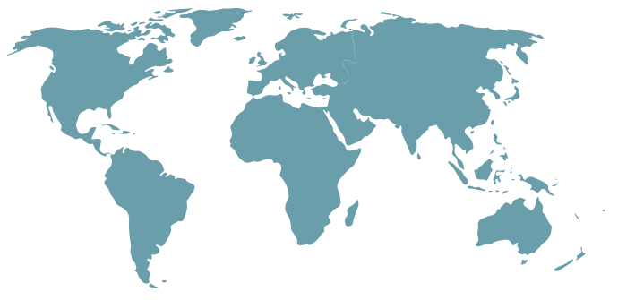

## React world map

- clickable world map with continent areas
- click on an area to select it (_approx. continents_)
- selecting it will change the className --> you add css to change the color
- built of SVG paths

#### [Demo](https://heatherbooker.github.io/react-world-map/)
#### [Codepen (interactive demo)](https://codepen.io/hboo/pen/yLaZWdb)



### usage:
```
npm install react-world-map --save
```
or, include
```
<script src=""https://cdn.jsdelivr.net/gh/heatherbooker/react-world-map@master/dist/index.js"></script>
```
in your html to use the script directly.

#### then in your `index.jsx` or `main.jsx` (see bottom for css):

Controlled component:
```jsx
<WorldMap selected={ 'sa' } onSelect={ (continent) => {} } />
```

Uncontrolled component:
```jsx
<WorldMap />
```

Uncontrolled component also supports multiple selection using the `multiple = { true }` prop. Example:
```jsx
<WorldMap
  multiple={ true }
/>
```

Full usage:
```jsx
const React, { useState } = require('react');
const ReactDOM = require('react-dom');
const WorldMap = require('react-world-map');

function YourMainComponent() {
  const [selected, onSelect] = useState(null);

  return (
    <>
      <h1> Hello World Map!</h1>
      <WorldMap selected={ selected } onSelect={ onSelect } />
    </>
  );
}

ReactDOM.render(
  <YourMainComponent />,
  document.getElementById('react-app')
)
```

#### Props
- `onSelect: (continentCode) => void`
- `selected: continentCode`

whereas the list of possible continents is as follows:
- `na` - North America
- `sa` - South America
- `af` - Africa
- `eu` - Europe
- `as` - Asia
- `oc` - Oceania

### make sure to set your css to target the map: 
```css
.map-selected {
  fill: #E3DA37;
}

.map-unselected {
  fill: #699EAA;
}

.map-selected:hover, .map-unselected:hover {
  cursor: pointer;
}
```

Please feel free to fork and PR if you think you have developed something useful!

license: **WTFPL**

bonus: [blog post on the making of this map](https://heatherbooker.github.io/blog/2016/06/21/interactive-react-map.html) :)
